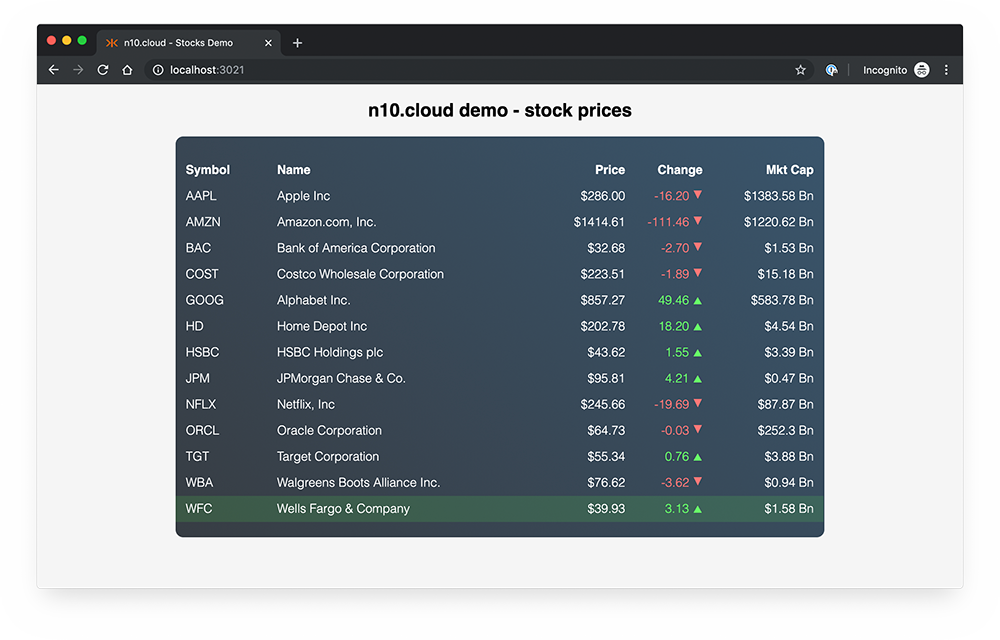

# nten.cloud-demo-stocks

Stocks demo for nten.cloud.

</img>

## Installation

Works with Node 10.

Run:

```bash
$ npm install
```

## Development

Before running the demo, you need to set `eventSourceUrl` in `src/App.js` to a valid URL. You can use the stock topic from your nten.cloud console for the `sandbox.stocks` topic.

### Running in dev mode

```bash
$ npm start
```

Runs the app in the development mode.

Open [http://localhost:3021](http://localhost:3021) to view it in the browser.

The page will reload if you make edits. You will also see any lint errors in the console.

## Deployment

`npm run build` creates a `build` directory with a production build of your app. Set up your favorite HTTP server so that a visitor to your site is served `index.html`, and requests to static paths like `/static/js/main.<hash>.js` are served with the contents of the `/static/js/main.<hash>.js` file.
